# Distributed Microservices Architecture — Payment Gateway Platform

A production-grade, resilient, and fully observable **payment gateway microservices backend**
written in **Go (Golang)**. Financial workloads — identity, cards, merchants, balances, topups,
transactions, transfers, withdrawals — are split across self-contained, independently deployable
services that communicate synchronously over **gRPC** and asynchronously over **Apache Kafka**,
behind a unified **REST API Gateway** (Echo + NGINX).

Analytical reads never touch the transactional tier: a **CQRS-style OLAP layer** powered by
**ClickHouse** is fed by `stats-writer` (a Kafka consumer) and served by `stats-reader`, a gRPC
analytics service returning monthly/yearly volumes, payment-method breakdowns, and transaction
status distributions.

Persistence is split into **three independent PostgreSQL 17 clusters — `pg_identity`,
`pg_payment`, `pg_financial` — one per bounded context, each fronted by its own PgBouncer
pooler**. A service can only ever reach the cluster its context owns, so cross-context schema
coupling is impossible by construction. A missing cluster prefix fails startup instead of
silently connecting to the wrong database.

---

## Table of Contents

1. [Key Features](#key-features)
2. [Architecture Overview](#architecture-overview)
3. [Service Catalog](#service-catalog)
4. [Database Layer — PostgreSQL Cluster & PgBouncer](#database-layer--postgresql-cluster--pgbouncer)
5. [Internal Service Architecture](#internal-service-architecture)
6. [Data & Event Flow](#data--event-flow)
7. [OLAP Analytics Layer](#olap-analytics-layer)
8. [AI Security Service](#ai-security-service)
9. [Observability Architecture](#observability-architecture)
10. [Deployment Architectures](#deployment-architectures)
11. [Technology Stack](#technology-stack)
12. [Getting Started](#getting-started)
13. [Port Map Registry](#port-map-registry)
14. [Makefile / Justfile Reference](#makefile--justfile-reference)
15. [Workspace Directory Tree](#workspace-directory-tree)

---

## Key Features

| Domain | Capabilities |
| :--- | :--- |
| **Auth & Users** | Registration, login, stateless JWT access/refresh token lifecycle, password reset, OTP email verification, `GetMe` profile resolver |
| **Roles & RBAC** | Permission configuration, granular access control, sub-second permission evaluation cached in Redis; role↔user assignment lives in its own `UserRoleService` (`CreateUserRole` / `DeleteUserRole` / `FindByUserId`) |
| **Cards & VCC** | Virtual and debit card CRUD, soft-delete, activation/suspension toggles, multi-dimensional card analytics (daily/monthly/yearly topup, withdraw, transfer) |
| **Merchants** | Merchant onboarding, profile details, business data, performance reports, full soft-delete & restore |
| **Saldo (Balance)** | High-throughput thread-safe real-time balance calculation with optimistic concurrency locks |
| **Topup** | Balance-loading ledger supporting multiple payment methods, detailed logging, soft-delete audit records |
| **Transaction** | Central financial audit ledger with global search filters, status tracking, monthly/yearly volume reports |
| **Transfer** | Peer-to-peer card-to-card / user-to-user settlement with synchronized debit/credit and event-driven logging |
| **Withdraw** | Settlement from cards to external accounts/banks with daily threshold limits and status pipelines |
| **OLAP Analytics** | ClickHouse warehouse fed by `stats-writer` (Kafka consumer) and served by `stats-reader` (gRPC analytics) |
| **Email Worker** | Kafka-driven worker dispatching OTPs, login alerts, merchant notices, and transfer/topup invoices over SMTP |
| **AI Security** | Python gRPC service consuming Kafka events with a Redis feature store for fraud/anomaly detection |
| **Persistence** | Three PostgreSQL 17 clusters — one per bounded context — each fronted by its own PgBouncer pooler |
| **Observability** | Prometheus + Grafana, Loki + Promtail, Jaeger + OpenTelemetry, Pyroscope profiling, Node/Kafka/Postgres/ClickHouse exporters, Alertmanager |
| **Deployment** | Docker Compose (full stack + infra-only), Kubernetes manifests with HPA, ArgoCD GitOps |

---

## Architecture Overview

Each service is a logical, decoupled Go binary inside `service/` with its own gRPC boundary. The
API Gateway is the only public edge: it authenticates the JWT, then translates REST/JSON into
downstream gRPC calls.

### Core Architecture Principles

- **Domain-Driven Boundary Isolation** — every service owns its database, cache, and logic. Cross-boundary database sharing is forbidden.
- **Three-Cluster Persistence** — one PostgreSQL instance and one PgBouncer pooler per bounded context (`pg_identity`, `pg_payment`, `pg_financial`). GORM clients and Goose migrations resolve their connection from the same per-context prefix; a missing prefix fails startup.
- **Dedicated PgBouncer Pooling** — each cluster is fronted by its own pooler so concurrent services cannot exhaust PostgreSQL sockets.
- **Clean Architecture** — `handler → service → repository`, wired in the service bootstrap.
- **OLAP & CQRS** — OLTP writes go to PostgreSQL; analytical reads go to ClickHouse via `stats-reader`.
- **Event-Driven Resilience** — Kafka decouples email delivery and stats materialization from the transactional path.
- **OTel Telemetry Integration** — trace IDs propagate from the REST edge through gRPC down to PostgreSQL, ClickHouse, and Redis.

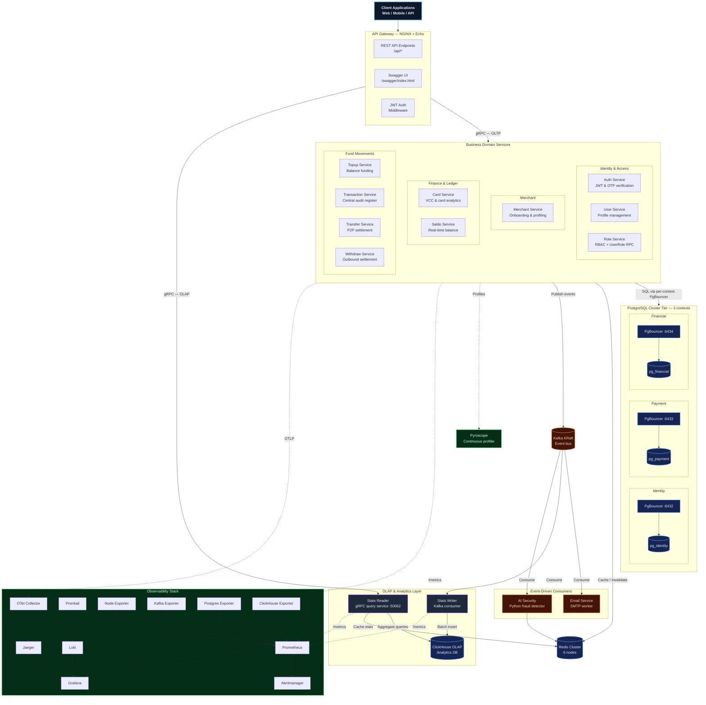

---

## Service Catalog

The workspace ships **12 domain services**, one REST API gateway, two OLAP workers, one AI
security worker, and an email worker.

| # | Service | Bounded Context | gRPC | Responsibility |
|---|---------|-----------------|------|----------------|
| 1 | `apigateway` | — | — (REST `:5000`) | REST/JSON edge, Swagger UI, JWT middleware, gRPC fan-out |
| 2 | `auth` | identity | `50051` | Register, login, refresh, password reset, OTP |
| 3 | `role` | identity | `50052` | Role CRUD + `UserRoleService` (create / delete / find-by-user) |
| 4 | `card` | payment | `50053` | Debit & virtual card management, card analytics |
| 5 | `merchant` | payment | `50054` | Merchant onboarding and profiling |
| 6 | `user` | identity | `50055` | User profiles, soft-delete/restore |
| 7 | `saldo` | payment | `50056` | Real-time balance with optimistic locking |
| 8 | `topup` | financial | `50057` | Balance funding ledger |
| 9 | `transaction` | financial | `50058` | Central audit register |
| 10 | `transfer` | financial | `50059` | P2P card-to-card transfer |
| 11 | `withdraw` | financial | `50060` | Outbound fund settlement |
| 12 | `email` | — | — | Kafka consumer → SMTP notifications |
| 13 | `stats-writer` | ClickHouse | — | Kafka consumer → ClickHouse |
| 14 | `stats-reader` | ClickHouse | `50062` | gRPC analytics over ClickHouse |
| 15 | `ai-security` | — | `50051` | Python Kafka consumer + Redis feature store for fraud detection |

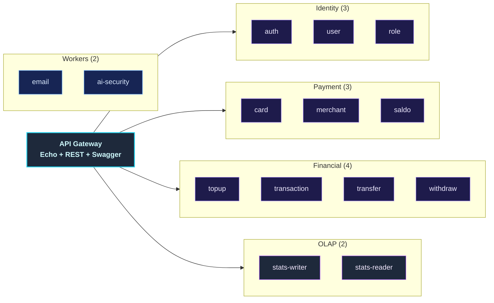

---

## Database Layer — PostgreSQL Cluster & PgBouncer

The gateway runs **three independent PostgreSQL 17 clusters** — one per bounded context.
"Cluster" means *one dedicated PostgreSQL instance per context*, not a replicated
primary/replica pair. The split keeps identity data, card/merchant/balance data, and the
financial movement ledger physically separate, so a runaway query or a bad migration in one
context cannot take down the others.

**Every cluster is fronted by its own PgBouncer pooler.** Services dial the pooler, never
PostgreSQL directly.

### Topology

| Bounded Context | PostgreSQL instance | Database | PgBouncer (host port) | Owning services |
| :--- | :--- | :--- | :--- | :--- |
| **Identity** | `postgres_identity` | `pg_identity` | `6432` | `auth`, `role`, `user` |
| **Payment** | `postgres_payment` | `pg_payment` | `6433` | `card`, `merchant`, `saldo` |
| **Financial** | `postgres_financial` | `pg_financial` | `6434` | `topup`, `transaction`, `transfer`, `withdraw` |

> **Pool mode differs per environment** — worth knowing when debugging prepared-statement or
> session-state behaviour:
> - **Local (Docker Compose)**: `POOL_MODE=transaction`
> - **Kubernetes**: `POOL_MODE=session`, with `MAX_CLIENT_CONN=1000`, `DEFAULT_POOL_SIZE=20`,
>   `MAX_PREPARED_STATEMENTS=100`
>
> Auth is `scram-sha-256` in both.

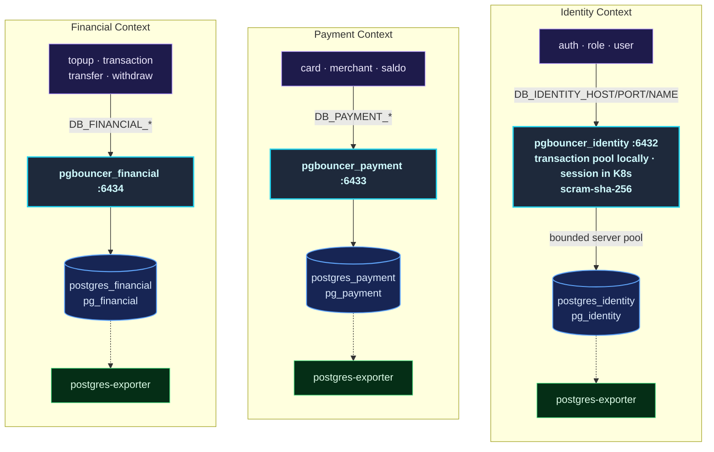

### Connection Lifecycle

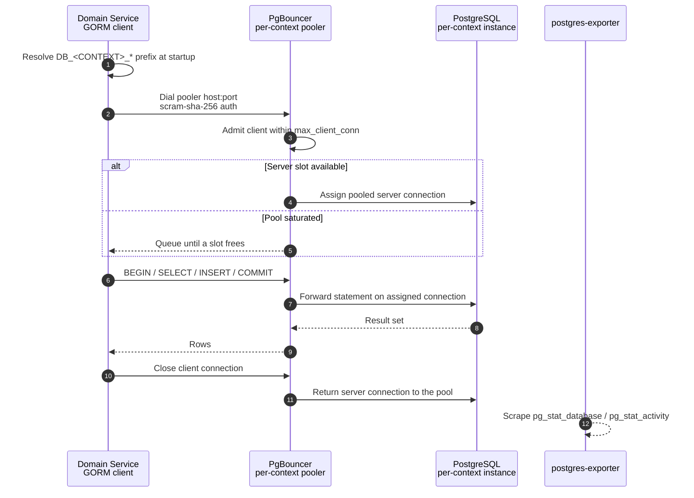

### Environment Contract

There is no generic `DB_HOST` / `DB_PORT` / `DB_NAME`. Each service declares its cluster once in
`service/<name>/cmd/main.go`:

```go
server.Config{
    DBCluster: database.IdentityCluster, // → "DB_IDENTITY"
    RedisCluster: "REDIS_1",
    // ...
}
```

`pkg/database/names.go` is the single source of truth:

| Constant | Env prefix | Database |
| :--- | :--- | :--- |
| `database.IdentityCluster` | `DB_IDENTITY` | `pg_identity` |
| `database.PaymentCluster` | `DB_PAYMENT` | `pg_payment` |
| `database.FinancialCluster` | `DB_FINANCIAL` | `pg_financial` |

Each prefix resolves `<PREFIX>_HOST` / `<PREFIX>_PORT` / `<PREFIX>_NAME`, pointing at the
context's **PgBouncer** service. Because the base `DB_*` keys are deliberately undefined, a
prefix typo produces a startup failure rather than a silent connection to the wrong database —
an important safety property for a financial ledger.

### Migrations

Migrations are **not** a separate step in this repo: each service applies its own **Goose**
migrations at startup against its bounded-context database, selected by the same cluster prefix.
Prefix-aware migration routing means `topup` can never accidentally migrate `pg_identity`.

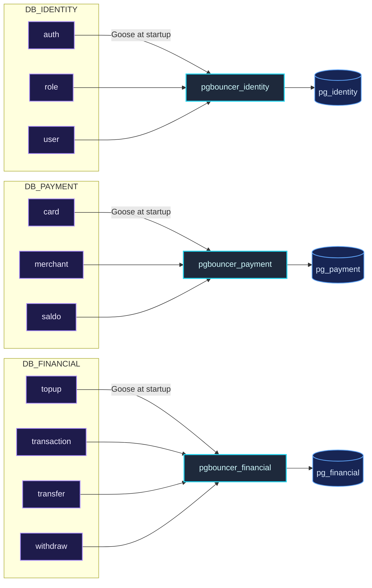

### Kubernetes Topology

In-cluster each context becomes a **StatefulSet + PVC** with a **Deployment** pooler in front:

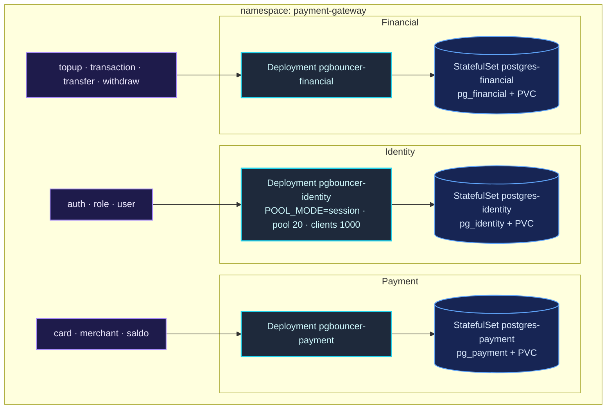

> PostgreSQL ports are not published to the host in either target — connect through PgBouncer
> (`6432`–`6434`).

---

## Internal Service Architecture

```mermaid
graph TB
    classDef handler fill:#1e3a5f,stroke:#7dd3fc,color:#e0f2fe,stroke-width:1.5px
    classDef service fill:#1e1b4b,stroke:#a78bfa,color:#ede9fe,stroke-width:1.5px
    classDef repo fill:#172554,stroke:#60a5fa,color:#dbeafe,stroke-width:1.5px
    classDef infra fill:#052e16,stroke:#4ade80,color:#dcfce7,stroke-width:1.5px
    classDef shared fill:#431407,stroke:#fb923c,color:#fed7aa,stroke-width:1.5px

    subgraph Service["service/<name>/"]
        direction TB

        CMD["cmd/main.go<br/>Entry point + DBCluster/RedisCluster selection"]

        subgraph Internal["internal wiring"]
            direction TB
            APPS["app/client.go or server.go<br/>Dependency injection"]:::handler
            HANDLER["handler/<br/>gRPC handlers"]:::handler
            MW["middleware/<br/>Interceptors"]:::handler
            SVC["service/<br/>Business logic"]:::service
            CACHE["cache/<br/>Redis cache layer"]:::service
            REPO["repository/<br/>Data access — GORM"]:::repo
        end

        CMD --> APPS
        APPS --> HANDLER
        APPS --> SVC
        APPS --> CACHE
        APPS --> REPO
        HANDLER --> SVC
        SVC --> REPO
        SVC --> CACHE
    end

    subgraph SharedLibs["shared/ — Shared Libraries"]
        direction LR
        DOMAIN["domain/<br/>record / request / response"]:::shared
        OBS["observability/<br/>cache & tracing metrics"]:::shared
        CACHESHARED["cache/<br/>redis_cache.go"]:::shared
        MAPPER["mapper/<br/>Domain ↔ Proto"]:::shared
        ERRORS["errors/ + errorhandler/"]:::shared
    end

    subgraph PkgLibs["pkg/ — Platform Libraries"]
        direction LR
        PKGAUTH["auth/<br/>JWT manager"]:::infra
        PKGKAFKA["kafka/<br/>Producer / consumer"]:::infra
        PKGOTEL["otel/<br/>Tracing + metrics init"]:::infra
        PKGRES["resilience/<br/>Circuit breaker, rate limiter,<br/>load monitor, DependencyGuard"]:::infra
        PKGLOG["logger/<br/>Zap structured logging"]:::infra
        PKGSRV["server/<br/>gRPC bootstrap"]:::infra
        PKGDB["database/<br/>Prefix-aware GORM + Goose + error mapping"]:::infra
        PKGCH["clickhouse/<br/>OLAP connection factory"]:::infra
        PKGREDIS["redis/<br/>Cluster-aware Redis client"]:::infra
        PKGADAPTER["adapter/role · adapter/user_role<br/>guarded gRPC clients"]:::infra
    end

    PB["pb/<br/>Generated protobuf Go code"]:::shared
    PGB_EXT["PgBouncer per context"]:::infra

    REPO --> DOMAIN
    REPO --> PGB_EXT
    SVC --> DOMAIN
    SVC --> OBS
    HANDLER --> PB
    HANDLER --> MAPPER
    APPS --> PKGSRV
    APPS --> PKGOTEL
    APPS --> CACHESHARED
    APPS --> PKGADAPTER
    APPS --> OBS
```

### Cross-Context Access: the Adapter Pattern

`service/auth` and `service/user` need role data but must not open a second database connection.
They use typed gRPC adapters, each wrapped in a `DependencyGuard` (per-call timeout + circuit
breaker + bulkhead):

| Adapter | Package | Backing RPC | Used by |
| :--- | :--- | :--- | :--- |
| `RoleAdapter` | `pkg/adapter/role` | `RoleService` — `FindById`, `FindByName` | `service/auth`, `service/user` |
| `UserRoleAdapter` | `pkg/adapter/user_role` | `UserRoleService` — `CreateUserRole`, `DeleteUserRole` | `service/auth` |

---

## Data & Event Flow

### Synchronous Flow — REST → gRPC → Redis → PgBouncer → PostgreSQL

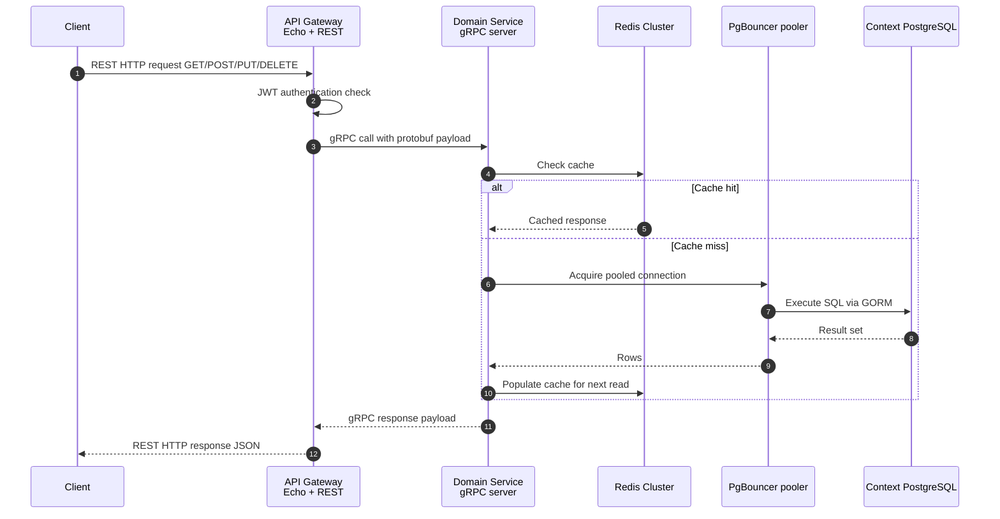

### Asynchronous Flow — Kafka Notification & Stats Pipeline

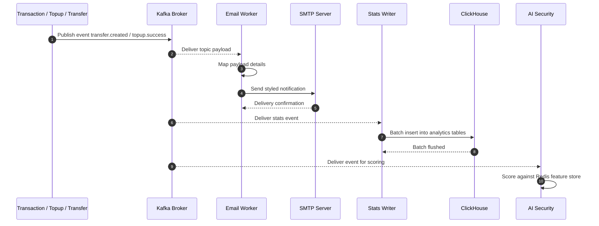

### Fund Movement Flow — Transfer

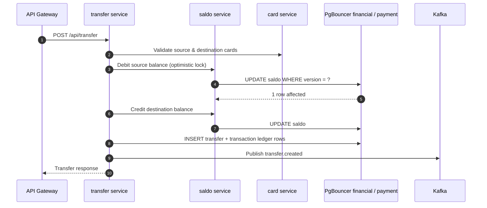

---

## OLAP Analytics Layer

Transactional writes land in the per-context PostgreSQL clusters; analytical reads are served by
ClickHouse through `stats-reader` on port `50062`, which the API Gateway calls with cache-aside
Redis.

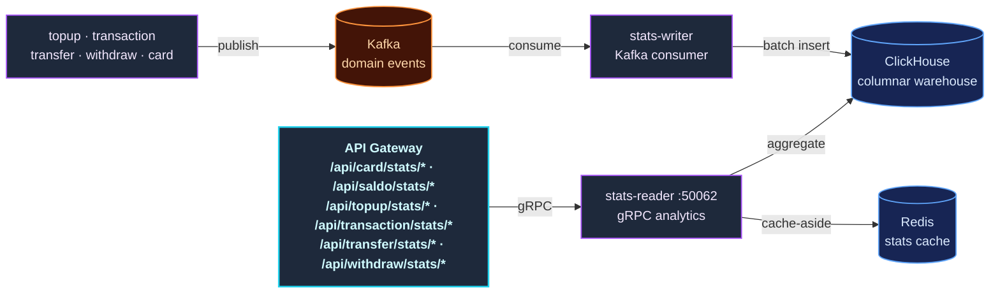

---

## AI Security Service

`service/ai-security` is a **Python** worker that consumes the same Kafka event stream and scores
transactions for fraud/anomaly signals using a Redis-backed feature store.

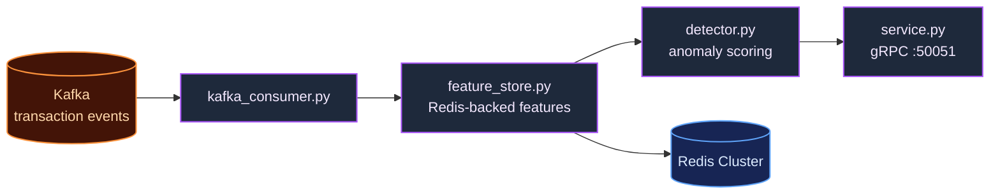

---

## Observability Architecture

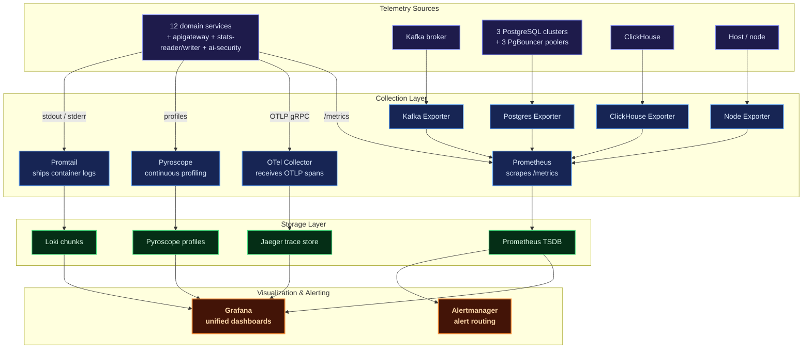

| Pillar | Tooling | What you get |
| :--- | :--- | :--- |
| **Metrics** | Prometheus + Grafana | CPU/memory, request error rates, gRPC latencies, database connection states |
| **Logging** | Loki + Promtail | Structured JSON indexed per service, queryable with LogQL |
| **Tracing** | OpenTelemetry + Jaeger | End-to-end traces across REST → gRPC → PostgreSQL / ClickHouse / Redis |
| **Profiling** | Pyroscope | Continuous CPU/memory profiling to catch allocation leaks in transaction loops |
| **Alerting** | Alertmanager | Notifications on latency spikes and service disconnects |

---

## Deployment Architectures

### Docker Compose (Local Development)

Two compose files live under `deployments/local/`:

- **`docker-compose.yml`** — the whole platform: 3 PostgreSQL + 3 PgBouncer, a 6-node Redis
  cluster, ClickHouse, Kafka, Pyroscope, all Go services, `ai-security`, and the observability
  stack.
- **`docker-compose.infra.yml`** — **infra-only** for native development: the 3
  PostgreSQL/PgBouncer pairs, Redis, Kafka, ClickHouse, and observability, publishing PgBouncer on
  host ports `6432`–`6434`.

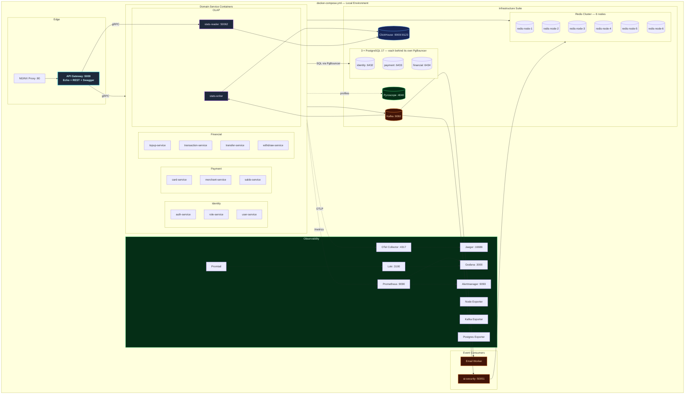

### Kubernetes (Production) + ArgoCD GitOps

Production runs in the `payment-gateway` namespace: one Deployment + Service + HPA per domain
service, one StatefulSet + PVC per PostgreSQL context, one Deployment per PgBouncer pooler, and a
ClickHouse deployment whose schema ships as a ConfigMap. Delivery is GitOps-driven via ArgoCD
(`deployments/gitops/argocd/`) with overlays under `deployments/kubernetes/overlays/`.

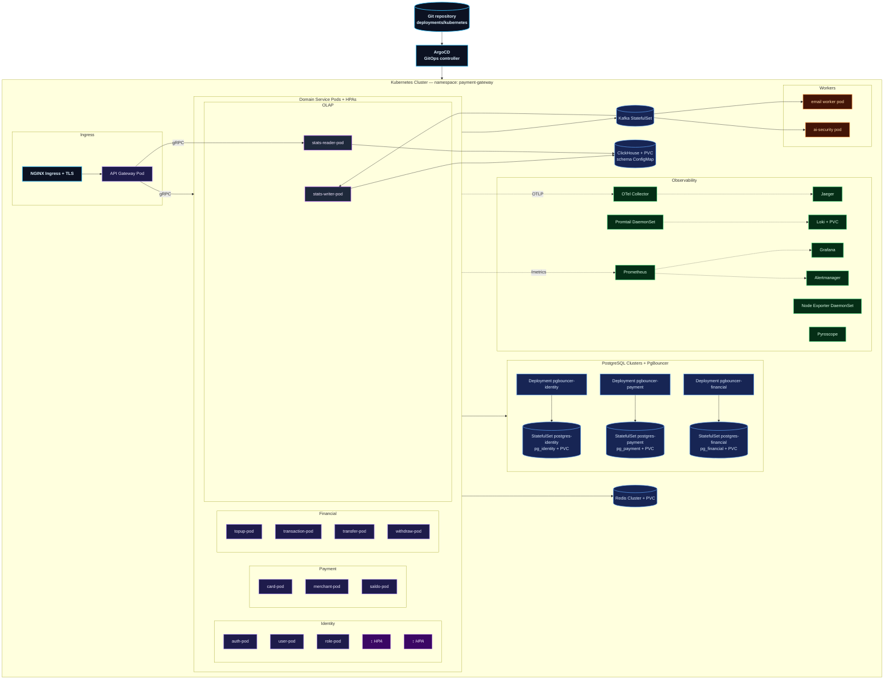

---

## Technology Stack

| Category | Technology | Purpose |
| :--- | :--- | :--- |
| **Language** | Go (Golang) + Python | Go for services, Python for `ai-security` |
| **API Edge Gateway** | Echo (REST) | REST API gateway with auto-generated Swagger UI |
| **RPC Inter-service** | gRPC + Protobuf | Contract-first synchronous communication |
| **OLTP Database** | PostgreSQL 17 ×3 | Database-per-bounded-context: `pg_identity`, `pg_payment`, `pg_financial` |
| **Connection Pooler** | PgBouncer ×3 | One pooler per cluster — `transaction` locally, `session` in K8s — host ports `6432`–`6434` |
| **OLAP Database** | ClickHouse | Columnar warehouse for analytics aggregations |
| **ORM** | GORM | Object-relational mapping & query builder |
| **DB Migrations** | Goose | Prefix-aware migrations applied at service startup |
| **Caching Tier** | Redis Cluster | 6-node cluster with per-context prefixes (`REDIS_1`–`REDIS_3`) |
| **Messaging Stream** | Apache Kafka (KRaft) | Asynchronous high-throughput event bus |
| **Token Manager** | JWT | Stateless authentication & authorization |
| **Observability** | OpenTelemetry + Jaeger | Vendor-neutral telemetry pipeline and visualization |
| **Metrics / Dashboards** | Prometheus + Grafana | Scraping, dashboards, and alert rules |
| **Log Aggregation** | Loki + Promtail | Centralized structured log storage and shipping |
| **Continuous Profiler** | Pyroscope | Real-time CPU/memory profiling |
| **Alerting** | Alertmanager | Alert routing & notification dispatch |
| **Reverse Proxy** | NGINX | Edge routing and TLS termination |
| **Containerization** | Docker + Docker Compose | Local orchestration |
| **Orchestrator** | Kubernetes + HPA | Production auto-scaling pod infrastructure |
| **GitOps** | ArgoCD | Declarative continuous delivery |
| **Load Testing** | k6 | Performance and load test suites |
| **E2E Testing** | Hurl | HTTP endpoint E2E suites |
| **Resilience** | `pkg/resilience` | Circuit breaker, rate limiter, load monitor, `DependencyGuard` |

---

## Getting Started

### Prerequisites

- [Git](https://git-scm.com/)
- [Go](https://go.dev/) (v1.23+)
- [Docker](https://www.docker.com/) & [Docker Compose](https://docs.docker.com/compose/)
- [Just Task Runner](https://github.com/casey/just) or standard `make`
- [Protobuf Compiler](https://grpc.io/docs/protoc-installation/) (for codegen updates)

### 1. Clone the Workspace

```sh
git clone https://github.com/MamangRust/microservice-payment-gateway-grpc.git
cd microservice-payment-gateway-grpc
```

### 2. Prepare Environment Configurations

```sh
cp .env.example .env
cp deployments/local/docker.env.example deployments/local/docker.env
```

The PostgreSQL cluster contract lives there:

```dotenv
# Host = the context's PgBouncer service, never PostgreSQL itself
DB_IDENTITY_HOST=pgbouncer_identity
DB_IDENTITY_PORT=5432
DB_IDENTITY_NAME=pg_identity

DB_PAYMENT_HOST=pgbouncer_payment
DB_PAYMENT_PORT=5432
DB_PAYMENT_NAME=pg_payment

DB_FINANCIAL_HOST=pgbouncer_financial
DB_FINANCIAL_PORT=5432
DB_FINANCIAL_NAME=pg_financial
```

For **native** runs against `docker-compose.infra.yml`, point the hosts at `localhost` and the
ports at the published pooler ports `6432`–`6434`.

### 3. Start Local Environment

```sh
make build-up      # or: just build-up
```

Database migrations are **not** a separate step: each service applies its own Goose migrations at
startup against its bounded-context database, selected by the cluster prefix in
`service/<name>/cmd/main.go`.

```sh
make ps            # or: just ps
```

### 4. Access Services

| Service | URL |
| :--- | :--- |
| Swagger UI | [http://localhost/swagger/index.html](http://localhost/swagger/index.html) |
| REST API Gateway Edge | [http://localhost/api/*](http://localhost/api/*) |
| API Gateway Direct | [http://localhost:5000](http://localhost:5000) |
| Grafana | [http://localhost:3000](http://localhost:3000) (`admin`/`admin`) |
| Prometheus | [http://localhost:9090](http://localhost:9090) |
| Jaeger | [http://localhost:16686](http://localhost:16686) |
| Pyroscope | [http://localhost:4040](http://localhost:4040) |

```sh
make down          # or: just down
```

---

## Port Map Registry

| Application / Service | Port / URL |
| :--- | :--- |
| **auth** gRPC | `50051` |
| **role** gRPC | `50052` |
| **card** gRPC | `50053` |
| **merchant** gRPC | `50054` |
| **user** gRPC | `50055` |
| **saldo** gRPC | `50056` |
| **topup** gRPC | `50057` |
| **transaction** gRPC | `50058` |
| **transfer** gRPC | `50059` |
| **withdraw** gRPC | `50060` |
| **stats-reader** gRPC | `50062` |
| **ai-security** gRPC | `50051` |
| **PgBouncer — identity** (`pg_identity`) | `localhost:6432` |
| **PgBouncer — payment** (`pg_payment`) | `localhost:6433` |
| **PgBouncer — financial** (`pg_financial`) | `localhost:6434` |
| **Redis Cluster nodes** | `redis-node-1` … `redis-node-6` (`:6379`) |
| **Kafka** | `kafka-1:9092` |
| **ClickHouse native / HTTP** | `localhost:9000` / `localhost:8123` |

> PostgreSQL is **not** published to the host — connect through the PgBouncer ports above.

---

## Makefile / Justfile Reference

| Target | Scope |
| :--- | :--- |
| `build-up` / `just build-up` | Rebuild service images and launch Compose |
| `up` / `just up` | Launch Compose without rebuilding |
| `down` / `just down` | Stop Compose stacks |
| `ps` / `just ps` | Health, uptime, and mapped ports |
| `generate-proto` / `just generate-proto` | Compile `.proto` into Go models under `pb/` |
| `generate-swagger` / `just generate-swagger` | Regenerate OpenAPI/Swagger specs |
| `test-auth` / `just test-auth` | Integration tests for the `auth` module |
| `just test-unit` | Unit tests under `pkg/` |
| `just test-integration` | Integration tests under `tests/` |
| `just test-all` | Unit + integration |
| `just build` | Compile all services into `bin/` |
| `just tidy-all` | `go mod tidy` across all modules |

---

## Workspace Directory Tree

```
microservice-payment-gateway-grpc/
├── proto/                          # Protobuf contracts
│   ├── role/                       #   Role query specifications
│   ├── user_role/                  #   UserRole create/delete/find-by-user
│   ├── card/                       #   Virtual card specifications
│   ├── saldo/                      #   Balance specifications
│   ├── topup/                      #   Funding specifications
│   ├── transaction/                #   Audit register specifications
│   ├── transfer/                   #   P2P transfer specifications
│   ├── withdraw/                   #   Settlement specifications
│   ├── merchant/                   #   Merchant declarations
│   ├── merchant_document/          #   Verification documents
│   ├── stats/                      #   OLAP analytics query contracts
│   ├── ai_security/                #   Fraud detection contracts
│   ├── user/ auth/                 #   Identity contracts
│   └── common/                     #   Shared protobuf types
├── pb/                             # Compiled protobuf outputs
├── shared/                         # Consolidated workspace module
│   ├── domain/                     #   Domain models & requests
│   ├── mapper/                     #   Proto ↔ Go converters
│   ├── cache/                      #   Redis caching wrappers
│   ├── observability/              #   Cache/tracing interceptors
│   ├── errors/                     #   Error templates
│   └── errorhandler/               #   Error handling utilities
├── pkg/                            # Platform libraries module
│   ├── adapter/                    #   Guarded gRPC adapters (role, user_role)
│   ├── auth/                       #   JWT utilities
│   ├── database/                   #   Prefix-aware GORM + Goose + error mapping + names.go
│   ├── clickhouse/                 #   OLAP connection factory
│   ├── kafka/                      #   Kafka producer/consumer
│   ├── redis/                      #   Cluster-aware Redis connectors
│   ├── resilience/                 #   Circuit breaker, rate limiter, load monitor
│   ├── server/                     #   gRPC bootstrap
│   ├── otel/                       #   Telemetry hooks
│   ├── logger/                     #   Zap structured logging
│   ├── randomvcc/                  #   VCC issuance helpers
│   ├── rupiah/                     #   IDR currency helpers
│   └── api-key/                    #   API key generation & validation
├── service/                        # Business domains
│   ├── apigateway/                 #   REST API gateway (Echo)
│   ├── auth/ user/ role/           #   Identity context
│   ├── card/ merchant/ saldo/      #   Payment context
│   ├── topup/ transaction/         #   Financial context
│   │   transfer/ withdraw/
│   ├── stats-writer/               #   Kafka → ClickHouse (OLAP write)
│   ├── stats-reader/               #   ClickHouse → gRPC (OLAP read)
│   ├── email/                      #   Kafka notification worker
│   └── ai-security/                #   Python fraud detection worker
├── deployments/
│   ├── local/                      #   docker-compose.yml + docker-compose.infra.yml
│   ├── kubernetes/                 #   Database, cache, messaging, networking,
│   │                               #   observability, security, services, overlays
│   └── gitops/argocd/              #   ArgoCD project, root app, production app
├── seeder/                         #   Database seeder
├── hurl/                           #   Hurl E2E HTTP suites
├── k6/                             #   k6 load test suites
├── observability/                  #   Prometheus, Loki, OTel, Promtail configs
├── grafana/                        #   Pre-configured dashboard templates
├── nginx/                          #   Reverse-proxy edge rules
├── redis/                          #   Redis cluster configuration
├── tests/                          #   Integration tests
└── images/                         #   Architecture diagrams & dashboards
```

---

## License

This project is open-sourced under the MIT License for educational and development purposes.

---

<p align="center">
  Built with Go, gRPC, Apache Kafka, ClickHouse OLAP, PostgreSQL clusters behind PgBouncer, and a passion for high-performance financial microservices.
</p>
